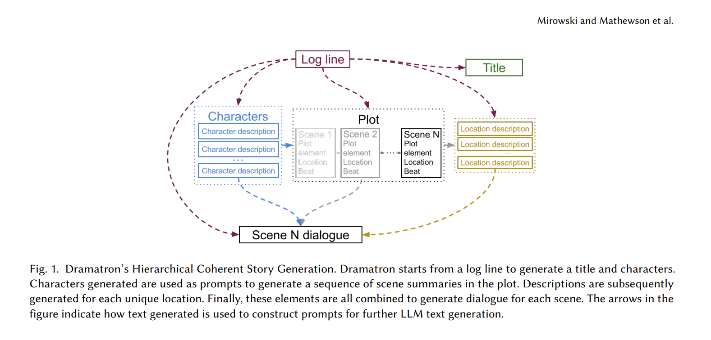

Modern language models are great at producing, and understanding, short passages of text. But if you've ever tried to generate longer, more complicated content, it can quickly become a confusing mess as the model loses track of what it should focus on.

In this post we'll explore a technique published by [DeepMind](https://deepmind.google/) for creating screenplays using LLMs. Although this is focused on creative writing, I think the techniques could be employed more widely with some modifications.

I've created an accompanying [notebook](https://github.com/layterz/promptx/tree/main/examples/dramatron) with all the code below if you want to try it out yourself.

<!--truncate-->

## Dramatron

DeepMind published [Co-Writing Screenplays and Theatre Scripts with Language Models: An Evaluation by Industry Professionals](https://arxiv.org/abs/2209.14958) in late 2022. The paper describes Dramatron – an algorithm for procedurally generating a coherent story by starting with a logline and sequentially generating a title, characters, an outline, location descriptions, and finally a script. The output of each step being passed to the next.



We'll implement a version of Dramatron using [promptx](https://github.com/layterz/promptx), a framework for working with generative models and embedding vector stores.

### Setup
First we need to install and setup promptx

```bash
pip install pxx
```

And now we need to configure the LLM we want to use. There are a few ways to do this, but for simplicity lets use environment variables.

```bash
export PXX_DEFAULT_LLM=chatgpt
export PXX_OPENAI_API_KEY=...
export PXX_OPENAI_ORG_ID=...
```

Let's test if it's working

```python
from promptx import prompt

output = prompt('Where is the capital of France?')
assert 'Paris' in output
```

In the simplest case prompt accepts a single instructions argument and returns a string as output, but we'll explore some more advanced uses below.

### Step 1: title generation

In screenwriting, a logline is a short 1–2 sentence summary of a story that captures the premise and peaks a readers interest. Here's an example

> "The patriarch of a powerful Italian mafia family passes the torch to his reluctant son whose moral dilemma and the ensuing power struggles lead to a blood-soaked path of loyalty, honor, and vengeance."

Dramatron expects a user defined logline as input and uses it to generate a title and character profiles. Let's start with the title.

```python
from promptx import prompt

def write_title(logline: str) -> str:
    return prompt(
        '''
        Suggest a alternative, original and descriptive 
        title for a known story.
        ''',
        dict(logline=logline),
    )

logline = '''
A computer hacker learns from mysterious rebels about the true 
nature of his reality and his role in the war against its controllers.
'''

title = write_title(logline)
>>> "The Cipher's Awakening: Unveiling the Matrix"
```

We're calling prompt with two arguments this time. In addition to the instructions we're also passing an input that the instructions act upon.

:::info

*Note: I would probably rewrite this prompt to something like:*

> Given a logline, suggest an alternative, original and descriptive title for a known story.

*That sets the expectation about the input and produces better results using `gpt-3.5-turbo`. However, I want to stick to the paper as much as possible so the alternative I landed on was to use a dict for the input so the key acts as an implicit label.*

:::

The generated titles aren't that good - they're too long and most have cringe taglines.

```
"The Cipher's Awakening: Unveiling the Matrix"
"The Digital Awakening: Uncovering the Truth in a War for Control"
"The Cyber Awakening: Unveiling the Illusionary Enigma"
"The Binary Revolution: Unveiling the Matrix of Power"
"The Cyber Awakening: Unveiling the Digital Truth"'
```

The paper uses few shot examples to guide the model output so let's add those and try again. `prompt` optionally accepts an example= keyword argument that should be a list of tuples representing the expected input/output pattern.

```python
from promptx import prompt

def write_title(logline: str) -> str:
    return prompt(
        'Suggest a alternative, original and descriptive title for a known story.',
        logline,
        examples = [
            (
                star_wars.logline,
                "The Death Star's Menace"
            ),
            (
                "Residents of San Fernando Valley are under attack by flying saucers from outer space. The aliens are extraterrestrials who seek to stop humanity from creating a doomsday weapon that could destroy the universe and unleash the living dead to stalk humans who wander into the cemetery looking for evidence of the UFOs. The hero Jeff, an airline pilot, will face the aliens.",
                "The Day The Earth Was Saved By Outer Space."
            )
        ]
    )

logline = '''
A computer hacker learns from mysterious rebels about the true 
nature of his reality and his role in the war against its controllers.
'''

title = write_title(logline)
>>> The Matrix Unleashed
```

Running this 5 times we get the following

```
"The Matrix Unleashed"
"The Matrix: Unraveling the Code"
"The Matrix: Unplugged"
"The Matrix: Unplugged" # it liked this one
"The Matrix: Unveiling the Digital World"
```

These still aren't that good, but it's an improvement. I'm not sure why all the taglines begin with `"Un"`.

Again, I think there are some changes that could be made to the prompts and examples, but let's stick to the paper for now and move on.

### Step 2: character profiles

This is more challenging because we need to generate a complex object and not a simple string. promptx lets you define expected output as a [Pydantic](https://docs.pydantic.dev/latest/) object so let's use that to define a character generation prompt.

We can pass an output= keyword argument to prompt, which should be a basic type (e.g. `int` , `str` , etc.) or a `BaseModel` subclass. If provided, it will be used to add formatting instructions to the prompt and validate the response.

```python
from pydantic import BaseModel

class Character(BaseModel):
    name: str
    description: str

def create_characters(logline: str, n=5) -> List[Character]:
    return prompt(
        f'Create {n} characters for a story.',
        input=logline,
        output=[Character],
        examples=[
            (
                star_wars.logline,
                star_wars.characters,
            ),
        ],
    ).objects

characters = create_characters(logline, n=3)
```

*Note: because prompt is returning a list the response will be a `Collection` object. To parse this into a list of Pydantic model instances we use the `objects` property.*

Here's some example output from the character generation prompt.

```python
[  
  Character(
    type='character',
    name='Neo',
    description='Neo is the protagonist. A computer hacker who discovers that the world he knows is a simulated reality created by machines. He joins the rebels to fight against the controllers.'
  ),
  Character(
    type='character',
    name='Morpheus',
    description='Morpheus is the leader of the rebels. He guides Neo in understanding the true nature of reality and his role in the war against the controllers.'
  ),
  Character(
    type='character',
    name='Trinity',
    description="Trinity is a skilled hacker and member of the rebellion. She becomes Neo's love interest and fights alongside him against the controllers."
  )
]
```

### Step 3: writing the outline

The next step is to generate the plot outline as a series of scene "beats", which consist of a location, scene description, and plot element. The plot element describes narrative stage: e.g. exposition or "a call to adventure". The specific terminology depends on the narrative framework being used.

The paper describes two different narrative frameworks: Freytag's pyramid and the hero's journey. Both are ways to break down the narrative progress of stories in a systematic way. We'll use the hero's journey - mostly because the Star Wars examples in the paper use that format.


We need to define a `SceneBeat` object. We can use an `enum` to constrain the plot element field to the expected strings.

```python
from enum import Enum

class PlotElement(str, Enum):
    call_to_adventure = "Call to Adventure"
    refusal_of_call = "Refusal of the Call"
    supernatural_aid = "Supernatural Aid"
    crossing_the_threshold = "Crossing the Threshold"
    belly_of_the_whale = "Belly of the Whale"
    road_of_trials = "Road of Trials"
    meeting_with_the_goddess = "Meeting with the Goddess"

class SceneBeat(BaseModel):
    location: str
    plot_element: str
    description: str

def write_outline(logline: str, characters: list[Character], n=10) -> List[SceneBeat]:
    return prompt(
        f'''
        Write a sequence of {n} scene beats for a story a hero's journey structure.
        ''',
        input=dict(logline=logline, characters=characters),
        output=[SceneBeat],
        examples=[
            (
                dict(
                    logline=star_wars.logline,
                    characters=star_wars.characters,
                ),
                star_wars.outline,
            ),
        ],
    ).objects

outline = write_outline(story.logline, story.characters)
```

These are the first three scenes beats generated.

```python
[
    Scenebeat(
        type='scenebeat',
        location="Neo's apartment",
        plot_element='The Ordinary World',
        description='Neo is living a mundane life as a computer hacker, unaware of the true nature of his reality.'
    ),
    Scenebeat(
        type='scenebeat',
        location='Unknown location',
        plot_element='Call to Adventure',
        description='Neo is contacted by the mysterious rebels led by Morpheus. They inform him that the world he knows is a simulation created by machines, and that he is the chosen one who can lead the rebellion against the controllers.\n            '
    ),
    Scenebeat(
        type='scenebeat',
        location='Abandoned building',
        plot_element='Refusal of the Call',
        description="Neo initially doubts his abilities and refuses to believe the truth. However, after encountering Agent Smith and narrowly escaping, he starts to consider Morpheus' offer.\n            "
    ),
    ...
]
```

### Step 4: extracting locations

Now we have an outline we can extract a location from each scene beat and generate a description for it. We keep track of known locations to avoid generating the same thing multiple times.

```python
class Location(BaseModel):
    name: str
    description: str

def extract_locations(outline) -> List[Location]:
    locations = []
    for beat in outline:
        if beat.location in [l.name for l in locations]:
            continue
        response = prompt(
            '''
            Generate a location based on location name. 
            ''',
            input=dict(name=beat.location),
            output=Location,
        )
    return locations

locations = extract_locations(outline)
```

Note: I omitted the examples for brevity. See the notebook for the full prompt.

Here are the first three locations generated.

```python
[
    Location(
        type='location',
        name="Neo's apartment",
        description="Neo's apartment is small and cluttered, with stacks of computer \n                        equipment and electronic gadgets scattered everywhere. The walls \n                        are covered in posters and graffiti, giving the place a rebellious \n                        and underground feel. The room is illuminated by the glow of computer \n                        screens and neon lights, creating a moody and mysterious atmosphere. \n                        "
    ),
    Location(
        type='location',
        name='Unknown location',
        description='The location is not known. Please provide a valid known location.\n                        '
    ),
    Location(
        type='location',
        name='Abandoned building',
        description='The abandoned building is a dilapidated structure, once \n                        bustling with life but now left to decay. Broken windows, \n                        crumbling walls, and graffiti cover the exterior. Inside, \n                        debris litters the floor, and the air is thick with dust. \n                        Shadows dance in the dim light, giving the space an eerie \n                        atmosphere.\n                        '
    ),
    ...
]
```

It failed to produce real output for the second location because the name "Unknown location" confused the model. Adding an example to cover the expected behavior might help.

How to handle invalid content and how to detect valid, but "incorrect" content is a larger issue, which I may cover in another post.

### Step 5: putting it all together

Now we have generated all the components, we can combine them to write a script for each scene. Before we define that, let's create a `Story` object to hold the data we've generated.

```python
class Story(BaseModel):
    logline: str
    title: str = None
    outline: List[SceneBeat] = None
    characters: List[Character] = None
    locations: List[Location] = None

    def __init__(self, logline, **kwargs):
        super().__init__(logline=logline, **kwargs)
```

Dramatron generates the script by iterating over each scene in the outline and passing the current beat description and plot element, the previous beat (if any), and the relevant details generated for each scene.

```python
def write_scene(story: Story, beat: SceneBeat, previous_beat: SceneBeat = None) -> str:
    try:
        location = next(filter(lambda x: x.name.lower() == beat.location.lower(), story.locations))
    except StopIteration:
        print(f'No location found for {beat.location}')
        return None
    
    return prompt(
        f'''
        Write a scene for a story based on the scene beat and location.
        ''',
        input=dict(
            plot_element=beat.plot_element,
            beat_description=beat.description,
            location=location.name,
            characters=story.characters,
            logline=story.logline,
            title=story.title,
            previous_beat=previous_beat,
        ),
    )

def write_script(story: Story, k: int = None) -> list[str]:
    previous_beat = None
    for beat in story.outline[:k or len(story.outline)]:
        scene = write_scene(story, beat, previous_beat)
        previous_beat = beat

script = write_script(story)
```

Here's the first page or so.

>**INT. NEO'S APARTMENT - LIVING ROOM - NIGHT**
>
>*The room is dimly lit, with the glow of computer screens illuminating Neo's face. He sits hunched over his desk, surrounded by multiple monitors displaying complex codes and algorithms.*
>
>*Neo, a young man in his late 20s with disheveled hair and tired eyes, furiously types away on his keyboard. He is a computer hacker, known in the online world as a genius. But in the real world, he leads a mundane and unfulfilled life.*
>
>*The sound of a knock on the door interrupts Neo's concentration. He reluctantly looks up and walks towards the door, curiosity piqued.*
>
>**NEO (sighs): Who could that be at this hour?**
>
>*Neo cautiously opens the door, revealing MORPHEUS, a tall and enigmatic man in his 40s. He wears a long, dark coat and exudes an air of mystery and authority.*
>
>**MORPHEUS (smiling): Hello, Neo. We meet at last.**
>
>*Confused, Neo looks at Morpheus, unsure of how this stranger knows his name.*
>
>**NEO (nervously): Who are you? How do you know my name?**
>
>*Morpheus steps inside the apartment, and Neo instinctively backs away, wary of this unexpected visitor.*
>
>**MORPHEUS: I know a lot about you, Neo. More than you think.**
>
>*Neo's eyes widen in disbelief, his curiosity growing.*
>
>**NEO (stammering): How… How is that possible?**
>
>*Morpheus smirks and reaches inside his coat, revealing a small, sleek device. He holds it out to Neo.*
>
>**MORPHEUS (whispering): Take this, Neo. It will show you the truth.**
>
>*Neo hesitates for a moment before cautiously accepting …*
>
>[CONTINUED]

## Conclusion

Does Dramatron produce great writing? No. But, hopefully this has demonstrated some techniques for controlling LLMs and combining the outputs of multiple prompts in coherent ways.

In a future post I'll explore some ideas to extend Dramatron using embeddings to combine generated outputs in more meaningful ways.