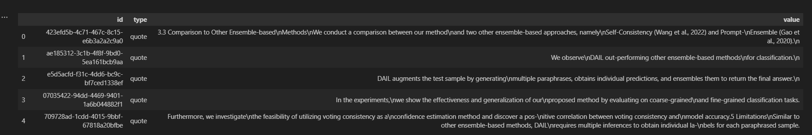

[Retrieval Augmented Generation (RAG)](https://arxiv.org/pdf/2205.14704.pdf) has become a standard approach to building LLM interfaces on top of specific data, but it can struggle in cases where the input doesn't overlap meaningfully with the stored embeddings.

In this post, I want to explore a solution to this by introducing a ***thought-generation*** step. The process works as follows:

1. Text chunks are first passed to a prompt to generate thoughts about the passage.
2. The generated thoughts are then embedded
3. RAG interface uses the generated thoughts as context

All tests are done using `chatgpt-3.5-turbo` and can be run using the [notebook](https://github.com/layterz/promptx/blob/main/examples/arxiv-reader/arxiv-reader.ipynb).

<!--truncate-->

## Setting up promptx

We're going to use [promptx](https://github.com/layterz/promptx) to handle the LLM interaction and embeddings.

```bash
pip install pxx
```

And now we need to configure the LLM we want to use.

```bash
export PXX_DEFAULT_LLM=chatgpt
export PXX_OPENAI_API_KEY=...
export PXX_OPENAI_ORG_ID=...
```

To see how to use other models take a look at the [documentation](https://github.com/layterz/promptx#configuration).

Now, let's test that it's working.

```python
from promptx import prompt

output = prompt('Where is the capital of France?')
assert 'Paris' in output
```

## Storing quotes

I'm using the paper [DAIL: Data Augmentation for In-Context Learning via Self-Paraphrase](https://arxiv.org/abs/2311.03319). It uses an ensemble approach to boost the performance of prompting generative models.

Let's start by simply storing each sentence from the paper as a quote. When you store something in **promptx** it creates an embedding, which will allow us to query the quotes to augment question answering and other tasks.

First, we need to define `Quote` and `Document` entities. The `Entity` class is a thin wrapper on top of `pydantic.BaseModel`, which allows it to be stored as an embedding.

```python
from promptx import Entity

class Document(Entity):
    title: str
    authors: list[str]
    abstract: str
    url: str

class Quote(Entity):
    text: str
    source_id: str
    start: int
    end: int
```

Now, we need to iterate over the paper and create the quote embeddings. I'm using `spacy` to split the paper into sentences, but you can use `nltk` or whatever method you want as long as the text is split into small enough chunks to be meaningfully embedded.

```python
import spacy
from promptx import store

paper = 'DAIL: Data Augmentation for In-Context Learning via Self-Paraphrase...'
nlp = spacy.load('en_core_web_sm')
doc = nlp(paper)
quotes = [
    Quote(text=sent.text, source_id=paper.id, start=sent.start_char, end=sent.end_char)
    for sent in doc.sents
]

store(*quotes, collection='quotes')
```

This stores the quotes in a `promptx` collection. Let's query that to see what quotes we have.

```python
from promptx import query

quotes = query('how does the paper use ensembles?', collection='quotes', limit=10)
```


The response from `query` is a `Collection`, which extends `pd.Dataframe` - allowing you to use standard pandas filtering and aggregation methods.

```python
# remove any quotes that are too short
quotes = quotes[quotes['text'].str.len() > 25]
```

## Generating thoughts

Next, let's consider what we do when we read something like a paper. We don't just remember quotes, we also have thoughts and ideas. We can do the same thing with **promptx** by defining a `Thought` entity and crafting prompts to elicit interesting thoughts.

```python
from enum import Enum
from promptx import Entity

class ThoughtType(Enum):
    question = 'question'
    idea = 'idea'
    comment = 'comment'
    critique = 'critique'
    fact = 'fact'

class Thought(Entity):
    text: str
    thought_type: ThoughtType
    source_id: str
    start: int
    end: int
```

Above, we define a `Thought` entity, but this time we're using an `enum` which will restrict the allowed values for `thought_type`.

Now, we can use this to generate thoughts while we're reading the paper. By setting `output=[Thought]` we're telling **promptx** to return a list of `Thought` objects instead of the default string output.

```python
from promptx import prompt

def read(doc: list[str], bs=5, limit=None):
    thoughts = []
    for chunk in batch(doc, bs=bs, limit=limit):
        output = prompt(
            '''
            Given a passage from a document, generate a list of thoughts 
            about the passage. Don't repeat yourself!
            ''',
            input=dict(
                passage=chunk,
            ),
            output=[Thought],
        ).objects

        thoughts += output
    return thoughts
```
:::info
The output from `prompt` is a `Collection` just like `query`. Above, we convert it to a list of `Entity` objects using the `objects` property.
:::

To avoid reading the document again, we can use the stored quotes.

```python
quotes = query(collection='quotes')
read([q.text for q in quotes.objects])
```

```
'Data Augmentation for In-Context Learning via Self-Paraphrase',
'ICL requires high-quality annotated demonstrations which might not be available in real-world scenarios.',
'DAIL leverages the intuition that large language models are more familiar with the content generated by themselves.',
'It first utilizes the language model to generate paraphrases of the test sample and employs majority voting to determine the final result based on individual predictions.',
'Our extensive empirical evaluation shows that DAIL outperforms the standard ICL method and other ensemble-based methods in the low-resource scenario.',
'Additionally, we explore the use of voting consistency as a confidence score of the model when the logits of predictions are inaccessible.',
'We believe our work will stimulate further research on ICL in low-resource settings.',
'Recently, the rapid development of large language models (LLMs) and their striking skill and knowledge have sparked significant interest in In-Context Learning (ICL).',
'Under ICL, there is no parameter adjustment to LLMs.',
'The model is given an instruction, task description, in-context samples, and a test case.',
'In-Context Learning (ICL) combined with pre-trained large language models has achieved promising results on various NLP tasks.',
'ICL requires high-quality annotated demonstrations which might not be available in real-world scenarios.',
'DataAugmentation for In-Context Learning (DAIL) is proposed to overcome this limitation.',
'DAIL leverages the intuition that large language models are more familiar with the content generated by themselves.',
'It first utilizes the language model to generate paraphrases of the test sample and employs majority voting to determine the final result based on individual predictions.',
'Our extensive empirical evaluation shows that DAIL outperforms the standard ICL method and other ensemble-based methods in the low-resource scenario.',
'Additionally, we explore the use of voting consistency as a confidence score of the model when the logits of predictions are inaccessible.',
'We believe our work will stimulate further research on ICL in low-resource settings.',
'Recently, the rapid development of large language models (LLMs) (Devlin et al., 2018; Radford et al., 2019) and their striking skill and knowledge have sparked significant interest in In-Context Learning (ICL) (Brown et al., 2020).',
'Different from other training-based paradigms, under ICL, there is no parameter adjustment to LLMs.',
'In-Context Learning (ICL) combined with pre-trained large language models has achieved promising results on various NLP tasks.',
'ICL requires high-quality annotated demonstrations which might not be available in real-world scenarios.',
'Data Augmentation for In-Context Learning (DAIL) is proposed to overcome the limitation of high-quality annotated demonstrations not being available in real-world scenarios.',
'DAIL leverages the intuition that large language models are more familiar with the content generated by themselves.',
'It first utilizes the language model to\ngenerate paraphrases of the test sample and\nemploys majority voting to determine the final\nresult based on individual predictions.',
'Our ex-\ntensive empirical evaluation shows that DAIL\noutperforms the standard ICL method and other\nensemble-based methods in the low-resource\nscenario.',
'Additionally, we explore the use of\nvoting consistency as a confidence score of the\nmodel when the logits of predictions are inac-\ncessible.',
'We believe our work will stimulate\nfurther research on ICL in low-resource set-\ntings.',
'Recently, the rapid development of large language\nmodels (LLMs) (Devlin et al., 2018; Radford et al.,\n2019) and their striking skill and knowledge have\nsparked significant interest in In-Context Learning\n(ICL) (Brown et al., 2020).',
'Different from other training-based paradigms, under ICL, there is no parameter adjustment to LLMs.'
```

This could be taken a lot further. E.g. by using RAG during thought generation, using [step-back prompts](https://arxiv.org/abs/2310.06117), or with user defined instructions to guide the types of thoughts to generate. However, without a solid way to evaluate the usefulness, it's easy to over-engineer so let's see how it performs first.

## Question prompting

```python
def qa(question, collection):
    context = query(question, collection=collection)
    output = prompt(
        '''
        Given a question and a list of quotes, answer the question.
        ''',
        input=dict(
            question=question,
            context=[c.text for c in context.objects]
        ),
    )
    return output
```

Let's try the standard RAG approach first by just using quotes.

```python
qa('Can you explain the main thesis of the paper?', collection='quotes')
```
> The main thesis of the paper is that the proposed method, called DAIL, out-performs other ensemble-based methods for classification. The paper also presents experiments that demonstrate the effectiveness and generalization of the proposed method on coarse-grained and fine-grained classification tasks.

This isn't that helpful - it is able to pick out the name (DAIL) and some aspects of the paper, but isn't able to describe the core idea behind the paper.

Let's try it with the generated thoughts.

```python
qa('What is the name of the proposed method?', collection='thoughts')
```
> The main thesis of the paper is that a new method called DAIL (In-Context Learning) outperforms the standard ICL method and other ensemble-based methods in low-resource scenarios. **DAIL leverages the intuition that large language models are more familiar with the content generated by themselves**. It first utilizes the language model to generate paraphrases of the test sample and employs majority voting to determine the final result based on individual predictions. The authors believe that their work will stimulate further research on ICL in low-resource settings.

This is much better. Crucially, it's identified the main idea behind the paper.

## Next steps

I haven't tested this on any benchmarks or using any objective metrics, but it seems like a promising approach. In a future post I'll explore how to evaluate the effectiveness of the generated thoughts using `promptx.evaluate()`.